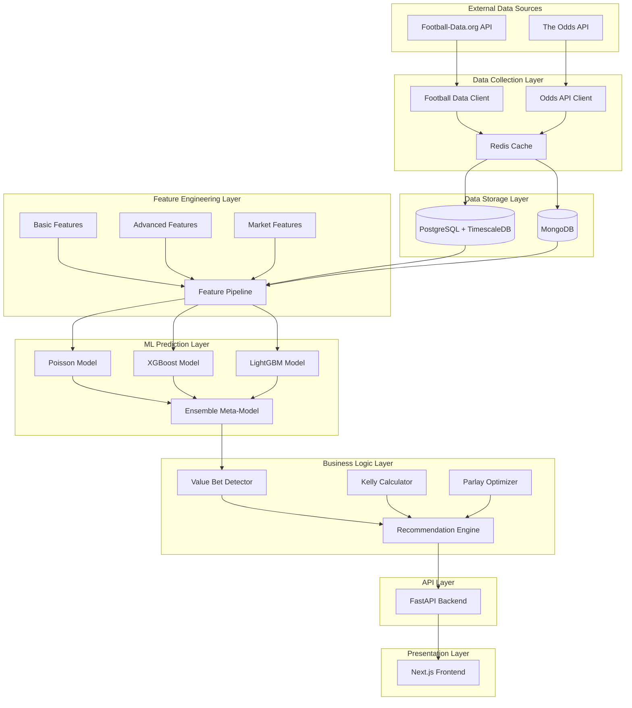
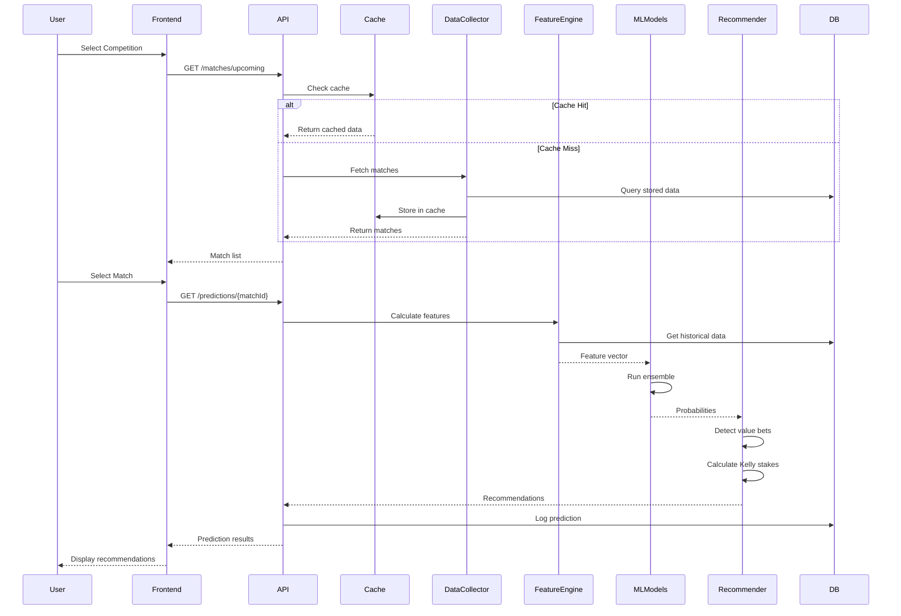
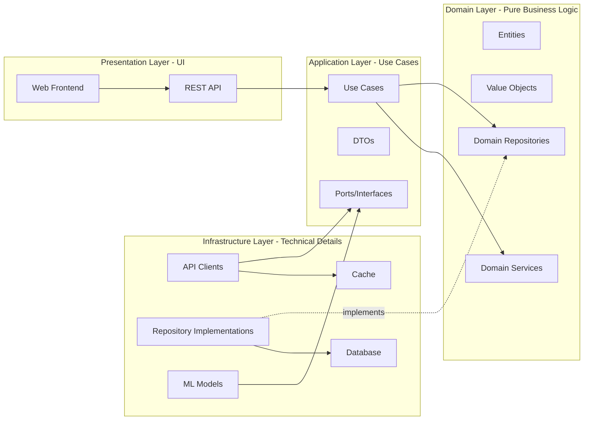

# Sports Betting Intelligence Platform

Enterprise-grade sports betting intelligence platform with machine learning predictions, value bet detection, and professional web interface.

## Features

- **Multi-League Support**: La Liga, Serie A, Premier League, Bundesliga, Champions League
- **Real-time Data**: Integration with Football-Data.org API and The Odds API
- **ML Predictions**: Ensemble models (XGBoost + LightGBM) with 50+ features
- **Value Bet Detection**: Kelly Criterion-based bet sizing and edge calculation
- **Backtesting Framework**: Walk-forward validation to prevent data leakage
- **Professional UI**: Next.js frontend with real-time updates
- **Scalable Architecture**: Clean Architecture with Docker containerization

## Architecture

The project follows **Screaming Architecture** and **Clean Architecture** principles, organizing code by business features rather than technical layers.

### System Architecture Overview



### Data Flow Diagram



### Clean Architecture Layers

The system is organized into 4 distinct layers following Clean Architecture principles:



**Layer Descriptions:**

1. **Domain Layer** (Innermost - No Dependencies)
   - Pure business logic independent of frameworks
   - Entities: Match, Team, Prediction, Bet
   - Value Objects: Odds, Probability, Confidence
   - No external dependencies, no database code, no API calls

2. **Application Layer** (Use Cases)
   - Orchestrates domain logic for specific use cases
   - Use Cases: PredictMatchUseCase, GenerateRecommendationsUseCase
   - DTOs for input/output
   - Defines interfaces (ports) for infrastructure

3. **Infrastructure Layer** (Technical Implementation)
   - Implements technical details and external integrations
   - API Clients: Football-Data.org, The Odds API
   - ML Models: XGBoost, Poisson, Ensemble
   - Database: PostgreSQL, MongoDB, Redis

4. **Presentation Layer** (UI/API)
   - Handles user interaction
   - FastAPI REST endpoints
   - Next.js web application

### Project Structure

```
sports-betting-predictor/
├── src/
│   ├── prediction/          # FEATURE: Match Prediction
│   │   ├── domain/          # Business logic
│   │   ├── application/     # Use cases
│   │   └── infrastructure/  # ML models
│   ├── data_collection/     # FEATURE: Data Collection
│   │   ├── domain/          # Data entities
│   │   ├── application/     # Fetch use cases
│   │   └── infrastructure/  # API clients
│   ├── feature_engineering/ # FEATURE: Feature Engineering
│   │   ├── domain/          # Feature definitions
│   │   ├── application/     # Calculation use cases
│   │   └── infrastructure/  # Calculators
│   ├── recommendation/      # FEATURE: Bet Recommendations
│   │   ├── domain/          # Value bet logic
│   │   ├── application/     # Recommendation use cases
│   │   └── infrastructure/  # Analyzers
│   ├── backtesting/         # FEATURE: Backtesting
│   │   ├── domain/          # Backtest logic
│   │   ├── application/     # Validation use cases
│   │   └── infrastructure/  # Validators
│   ├── api/                 # PRESENTATION: REST API
│   └── shared/              # SHARED: Common utilities
├── frontend/                # PRESENTATION: Web UI
├── tests/                   # Test suite
├── infrastructure/          # Docker configs
└── docs/                    # Documentation
```

## Tech Stack

**Backend**:
- Python 3.11+
- FastAPI (async API)
- SQLAlchemy 2.0 + PostgreSQL + TimescaleDB
- MongoDB (raw data)
- Redis (caching)
- Celery (task queue)

**ML**:
- Scikit-learn
- XGBoost
- LightGBM
- MLflow (experiment tracking)

**Frontend**:
- Next.js 14
- TypeScript
- TailwindCSS + shadcn/ui

**Infrastructure**:
- Docker + Docker Compose
- Nginx (reverse proxy)
- Prometheus + Grafana (monitoring)

## Quick Start

### Prerequisites

- Docker and Docker Compose
- Python 3.11+ (for local development)
- Node.js 18+ (for frontend)

### 1. Clone and Setup

```bash
# Clone repository
git clone <repository-url>
cd sports_beting_scraper

# Copy environment variables
cp .env.example .env

# Edit .env and add your API keys (already configured)
```

### 2. Start with Docker

```bash
# Start all services
docker-compose up -d

# Check services are running
docker-compose ps

# View logs
docker-compose logs -f backend
```

Services will be available at:
- Backend API: http://localhost:8000
- API Docs: http://localhost:8000/docs
- Flower (Celery monitoring): http://localhost:5555
- PostgreSQL: localhost:5432
- MongoDB: localhost:27017
- Redis: localhost:6379

### 3. Local Development (without Docker)

```bash
# Install dependencies with Poetry
poetry install

# Activate virtual environment
poetry shell

# Start databases (Docker)
docker-compose up -d postgres mongodb redis

# Run migrations
alembic upgrade head

# Start backend
uvicorn src.api.main:app --reload

# Start Celery worker (separate terminal)
celery -A src.data_collection.infrastructure.tasks.celery_app worker --loglevel=info

# Start frontend (separate terminal)
cd frontend
npm install
npm run dev
```

## Configuration

### League IDs (Football-Data.org)

The system is pre-configured for 5 major competitions:

| League | ID | Variable |
|--------|-----|----------|
| La Liga | 2014 | `LEAGUE_LALIGA_ID` |
| Serie A | 2019 | `LEAGUE_SERIEA_ID` |
| Premier League | 2021 | `LEAGUE_PREMIER_ID` |
| Bundesliga | 2002 | `LEAGUE_BUNDESLIGA_ID` |
| Champions League | 2001 | `LEAGUE_CHAMPIONS_ID` |

### Prediction Thresholds

```env
MIN_CONFIDENCE_THRESHOLD=0.70  # Minimum confidence to recommend bet
MIN_EDGE_THRESHOLD=0.05        # Minimum 5% edge over bookmaker
MAX_STAKE_PERCENTAGE=0.05      # Maximum 5% of bankroll per bet
KELLY_FRACTION=0.25            # Kelly Criterion safety factor
```

## Usage

### Fetch Match Data

```bash
# Test API connectivity
poetry run python scripts/test_apis.py

# Fetch upcoming matches
poetry run python scripts/fetch_matches.py --league premier
```

### Train Models

```bash
# Train ML models with historical data
poetry run python scripts/train_models.py

# Evaluate model performance
poetry run python scripts/evaluate_models.py
```

### Run Backtest

```bash
# Backtest on historical data
poetry run python scripts/run_backtest.py --start-date 2022-01-01 --end-date 2023-12-31
```

### API Endpoints

```bash
# Get upcoming matches
curl http://localhost:8000/api/matches/upcoming

# Get predictions for a match
curl http://localhost:8000/api/predictions/{match_id}

# Get today's recommendations
curl http://localhost:8000/api/recommendations/today

# Get performance metrics
curl http://localhost:8000/api/performance/metrics
```

## Development

### Run Tests

```bash
# Run all tests
poetry run pytest

# Run with coverage
poetry run pytest --cov=src --cov-report=html

# Run specific test file
poetry run pytest tests/unit/test_api_clients.py
```

### Code Quality

```bash
# Format code
poetry run black src tests

# Sort imports
poetry run isort src tests

# Lint
poetry run flake8 src tests

# Type check
poetry run mypy src
```

## Project Structure

```
sports-betting-predictor/
├── src/                    # Source code
│   ├── prediction/         # ML prediction feature
│   ├── data_collection/    # API integration
│   ├── feature_engineering/# Feature calculation
│   ├── recommendation/     # Value bet detection
│   ├── backtesting/        # Validation framework
│   ├── api/                # FastAPI backend
│   └── shared/             # Common utilities
├── frontend/               # Next.js frontend
├── tests/                  # Test suite
├── scripts/                # Utility scripts
├── infrastructure/         # Docker configs
├── models/                 # Trained ML models
├── data/                   # Data storage
└── docs/                   # Documentation
```

## Performance Targets

| Metric | Target |
|--------|--------|
| Win Rate | 55-60% |
| ROI | >5% |
| Sharpe Ratio | >1.0 |
| API Response Time | <500ms |
| Prediction Latency | <2s |

## Important Notes

### Realistic Expectations

- **Win Rate**: Target is 55-60%, not 80%+
- **ROI**: Sustainable 5-8% ROI over 100+ bets
- **Data Requirements**: Need 2-3 seasons of historical data
- **Market Efficiency**: Bookmakers are sophisticated, no system wins consistently without discipline

### Data Leakage Prevention

- **Walk-forward validation** only (no random splits)
- **Time-based splits** for all ML training
- **No future information** in features
- **Strict audit trail** of all predictions

### API Rate Limits

- **Football-Data.org**: 10 requests/minute (free tier)
- **The Odds API**: 500 requests/month (free tier)
- Consider upgrading to paid tiers for production use

## Contributing

1. Fork the repository
2. Create a feature branch (`git checkout -b feature/amazing-feature`)
3. Commit your changes (`git commit -m 'Add amazing feature'`)
4. Push to the branch (`git push origin feature/amazing-feature`)
5. Open a Pull Request

## License

This project is for educational purposes only. Use at your own risk. Gambling can be addictive - please bet responsibly.

## Support

For issues, questions, or contributions, please open an issue on GitHub.

---

**Disclaimer**: This system is for educational and research purposes. Past performance does not guarantee future results. Always bet responsibly and within your means.
